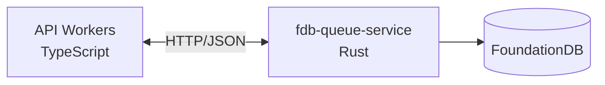
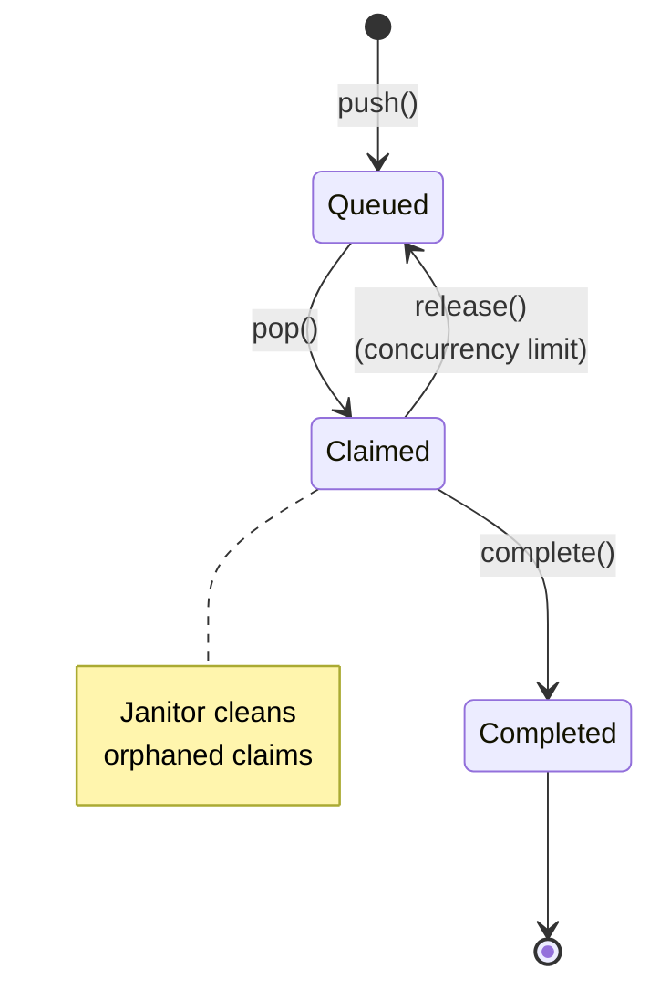

# fdb-queue-service

A Rust HTTP microservice that implements a priority job queue backed by FoundationDB. Used by Firecrawl workers to coordinate scrape jobs with per-team and per-crawl concurrency tracking.

## Architecture



The service exposes a REST API consumed by `fdb-queue-client.ts`. Workers push jobs, pop jobs for processing, and mark them complete. The client implements a circuit breaker for fault tolerance.

## Key Design: Conflict-Free Job Claims

Multiple workers competing for jobs use **versionstamp-based claims** to avoid transaction conflicts:

1. Worker does a **snapshot read** (no read conflicts) to find candidate jobs
2. Worker writes a claim to `claims/{job_id}/{versionstamp}` using `SetVersionstampedKey`
3. Versionstamps are globally unique, so claim writes **never conflict**
4. Lowest versionstamp wins — that worker owns the job
5. Loser moves on to the next candidate

This eliminates retry storms under high contention.

## Data Model

All keys use length-prefixed strings: `len(4 bytes BE) + bytes`.

### Subspace Prefixes

| Prefix | Name | Description |
|--------|------|-------------|
| `0x01` | Queue | Main job storage, ordered by team → priority → created_at |
| `0x02` | Crawl Index | Secondary index: crawl_id → job_id |
| `0x03` | Counters | Atomic counters for queue/active counts |
| `0x04` | Active (Team) | Currently processing jobs per team |
| `0x05` | Active (Crawl) | Currently processing jobs per crawl |
| `0x06` | TTL Index | Jobs with timeouts, ordered by expiry time |
| `0x07` | Claims | Versionstamp-keyed claim records |

### Key Formats

**Queue Key** (stores full job JSON):
```
0x01 | team_id_len | team_id | priority(i32 BE) | created_at(i64 BE) | job_id_len | job_id
```
Jobs are sorted by priority (lower = higher priority), then by creation time.

**Crawl Index Key** (stores team_id, priority, created_at):
```
0x02 | crawl_id_len | crawl_id | job_id_len | job_id
```

**Counter Key** (stores i64 LE):
```
0x03 | counter_type(1 byte) | id_len | id
```
Counter types: `0x01` = team queue, `0x02` = crawl queue, `0x03` = team active, `0x04` = crawl active.

**Active Job Key** (stores expires_at i64 BE):
```
0x04 | team_id_len | team_id | job_id_len | job_id    (team active)
0x05 | crawl_id_len | crawl_id | job_id_len | job_id  (crawl active)
```

**TTL Index Key** (stores priority, created_at, crawl_id):
```
0x06 | expires_at(i64 BE) | team_id_len | team_id | job_id_len | job_id
```

**Claim Key** (stores worker_id, queue_key, claimed_at):
```
0x07 | job_id_len | job_id | versionstamp(10 bytes)
```
The versionstamp is auto-assigned by FDB at commit time, ensuring uniqueness.

### Job Structure

```json
{
  "id": "job-uuid",
  "data": { ... },
  "priority": 10,
  "listenable": true,
  "createdAt": 1704067200000,
  "timesOutAt": 1704070800000,
  "listenChannelId": "channel-id",
  "crawlId": "crawl-uuid",
  "teamId": "team-uuid"
}
```

## Job Lifecycle



## Counters

Counters use FDB atomic `ADD` operations for conflict-free increments/decrements. They track:

- **Team queue count**: Jobs waiting in a team's queue
- **Crawl queue count**: Jobs waiting for a specific crawl
- **Team active count**: Jobs currently being processed for a team
- **Crawl active count**: Jobs currently being processed for a crawl

Counters can drift due to crashes. The janitor periodically reconciles them by counting actual records.

## Cleanup Operations

Janitor endpoints handle:

- `/cleanup/expired-jobs` — Remove jobs past their TTL
- `/cleanup/expired-active-jobs` — Remove stale active job markers
- `/cleanup/orphaned-claims` — Remove claims for non-existent jobs
- `/reconcile/*` — Fix counter drift

## API Endpoints

### Queue Operations
- `POST /queue/push` — Add job to queue
- `POST /queue/pop/:team_id` — Claim next available job
- `POST /queue/complete` — Remove completed job
- `POST /queue/release` — Release claim without completing
- `GET /queue/count/team/:team_id` — Get team queue depth
- `GET /queue/count/crawl/:crawl_id` — Get crawl queue depth

### Active Job Tracking
- `POST /active/push` — Mark job as actively processing (team)
- `DELETE /active/remove` — Unmark active job (team)
- `GET /active/count/:team_id` — Get team active count
- `POST /active/crawl/push` — Mark job as actively processing (crawl)
- `DELETE /active/crawl/remove` — Unmark active job (crawl)

### Maintenance
- `POST /cleanup/expired-jobs`
- `POST /cleanup/expired-active-jobs`
- `POST /cleanup/orphaned-claims`
- `POST /reconcile/team/queue/:team_id`
- `POST /reconcile/crawl/queue/:crawl_id`

## Configuration

| Env Var | Default | Description |
|---------|---------|-------------|
| `FDB_CLUSTER_FILE` | `/etc/foundationdb/fdb.cluster` | Path to FDB cluster file |
| `PORT` | `3100` | HTTP server port |
| `RUST_LOG` | `fdb_queue_service=info` | Log level |

## Building

```bash
cd apps/fdb-queue-service
cargo build --release
```

Requires FoundationDB client libraries installed on the host.
